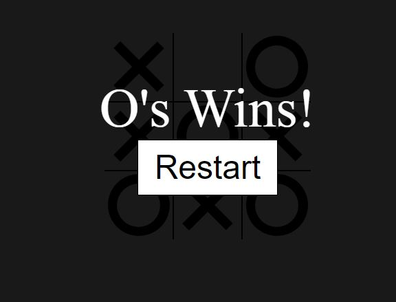

# Tic-Tac-Toe
Tic-Tac-Toe

index.html -> defines 9 div tags to hold keys and game result display

style.css -> Design, align, fonts, border etc..

script.js -> StartGame(), EndGame(), handleClick(), swapTurns(), placeMark(), setBoardHover(), checkWin(), isDraw() functionsa are 
defined for game moves and winner checking.

Result:

